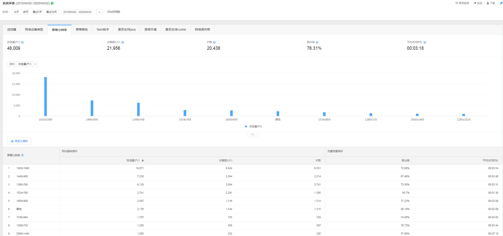

# 关于企业官网
## 前期准备工作
1) 从运营部获取用户行为信息：从客户行为信息中总结出pc端只需兼容到1024屏幕分辩率即可。

2) 初步规划所有页面：为设计各个页面做准备。
## 设计阶段
3) 设计阶段：前期收集销售、运营等各部门对视觉呈现的意见，初步了解设计需求，同时与运营部沟通交流，获取用户关注点，侧重设计用户关注点的页面。中期与设计总监深入交流，获取重要设计需要，和交互需求，原则上完成20%进行一次设计分析。

## 编写阶段
4) 代码阶段：响应式PC端(只需兼容到1024屏幕)。
- 网站需兼容IE浏览器，CSS使用float布局、并用html5shiv.js和respond.js兼容一些HTML5标签和CSS3属性。
- 对于产品展示方面，为了让用户看更多的产品详情和减少页面跳转频率，让用户在一个页面操作浏览其他页面信息，提高交互体验，产品详情展示采用iframe弹窗方式展示。
- iframe弹窗需要隐藏对应的滚动条，1、固定body，隐藏滚动条；2、隐藏iframe弹窗滚动条，页面可正常滚动。关闭iframe视口固定在当前滚动位置，并移除固定
- 新闻页面，采用三栏布局，中间内容显示区域宽度不能超过500px，两侧栏目在进入内容视口，侧边栏fixed，填充画面，保持画面平衡，离开内容视口内容区侧边栏relative在内容区底部(有争议地方，一方认为500px宽度太小，大屏幕时显得内容很小；另外一方则认为：500px宽度方便维护，兼容传统网站图片大小只有500px的情况)
- 案例展示采用瀑布流模式，解决分地区展示、数量不统一、单独页面全部罗列案例的问题，
- 轮播图采用Swiper.js、Swiper.js动画模式和Swiper.js联动控制提升交互
- 图片加载方式采用延时载模式，图片加载时，为了让提升用户体验，不能让用户在正常浏览中，感觉到有延时加载中的loading存在，每次加载，多加载3个视口高度的图片

